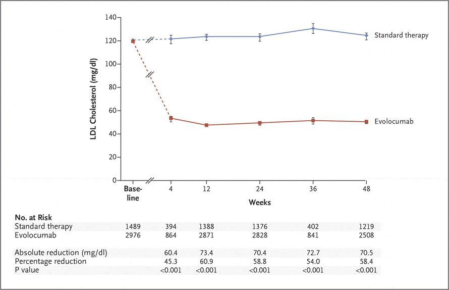

## Project: A Study of Association of LDL Reduction and Cataracts Using Meta-Analysis  
## Author: Davit Sargsyan
## Created: 12/03/2016

---

## Daily Logs
### DS, 07/29/2017
* Recreated meta regression plot for 11 studies, saved them as .TIFF, .PNG and .PDF, and emailed to Dr. Kostis for a presentation. Improvements include more and equaly spaced tick mark breaks on X and Y axis, centered title, and a horizontal line at OR = 1. All changes were made in the script [low_ldl_and_cataract.R](https://github.com/sargdavid/ldl.mab.cvi/blob/master/source/low_ldl_and_cataract.R)    

## eLetter in Journal of the American Heart Association (05/09/2017)
1. Article:    
[Yu, Shandong, Yanpeng Chu, Gang Li, Lu Ren, Qing Zhang, and Lin Wu. "Statin Use and the Risk of Cataracts: A Systematic Review and Meta‐Analysis." Journal of the American Heart Association. American Heart Association, Inc., 01 Mar. 2017.](http://jaha.ahajournals.org/content/6/3/e004180)    

2. Our eLetter: 
[John B. Kostis, Jeanne M. Dobrzynski, Davit Sargsyan, and William J. Kostis. "RE: Statin Use and the Risk of Cataracts"  Journal of the American Heart Association. American Heart Association, Inc., 09 May 2017"](http://jaha.ahajournals.org/content/6/3/e004180/tab-e-letters#re-statin-use-and-the-risk-of-cataracts)    

## References
### 1. [Robinson, Jennifer G., M.D., M.P.H., Michel Farnier, M.D., M.P.H., Michel Krempf, M.D., et. al. "Efficacy and Safety of Alirocumab in Reducing Lipids and Cardiovascular Events — NEJM." New England Journal of Medicine. 16 Apr. 2015.](http://www.nejm.org/doi/full/10.1056/NEJMoa1501031#t=article)

Trial: Long-term Safety and Tolerability of Alirocumab in High Cardiovascular Risk Patients with Hypercholesterolemia Not Adequately Controlled with Their Lipid Modifying Therapy (ODYSSEY LONG TERM, Phase III)
Follow-up Trial: Study to Evaluate the Effect of Alirocumab on the Occurrence of Cardiovascular Events in Patients Who Have Experienced an Acute Coronary Syndrome (ODYSSEY OUTCOMES).
Compound: Alirocumab  
Developer: Sanofi and Regeneron Pharmaceuticals  
Patients: 2,341  
LDL Inclusion Criteria: >= 70 mg/dL (1.8 mM)  
Treatment(150 mg of alirocumab):Placebo at 2:1 ratio by-weekly for 78 weeks     
Co-theraphy: maximum tolerated dose of statins  
Primary efficacy endpoint: % change LDL at 12 weeks  

Reported: Absolute level of LDL at 12 weeks with 95% C.I. 

  

### 2. [Marc S. Sabatine, M.D., M.P.H., Robert P. Giugliano, M.D., Stephen D. Wiviott, M.D., et. al. "Efficacy and Safety of Evolocumab in Reducing Lipids and Cardiovascular Events — NEJM." New England Journal of Medicine. 16 Apr. 2015](http://www.nejm.org/doi/full/10.1056/NEJMoa1500858#t=article)

Trials: Open-Label Study of Long-Term Evaluation against LDL Cholesterol 1 and 2 (OSLER-1, Phase II, and OSLER-2, Phase III)  
Compound: Evolocumab  
Developer: Amgen  
Patients: 1,324 in OLSER-1 + 3,141 in OLSER-2 = 4,465  
LDL Inclusion Criteria: multiple, spesified in 12 parental studies (Table 1)  
Treatment(140 mg of evolocumab byweekly or 420 monthly):Placebo at 2:1 ratio, for 1 year  
Co-theraphy: multiple, spesified in 12 parental studies (Table 1) 
Secondary endpoint: % change LDL at 24 weeks 

Reported: Absolute level of LDL at 12 weeks with 95% C.I.  

NOTE: Not clear how estimates were calculated and what is being reported/plotted.    
The plot above and the associated table (Supplemental Table S1) use medians and means simultaniously.  
Also, reported is the combination of the 2 studies above but it si unclear how the studies were combined.  
Results need clarification. 

  